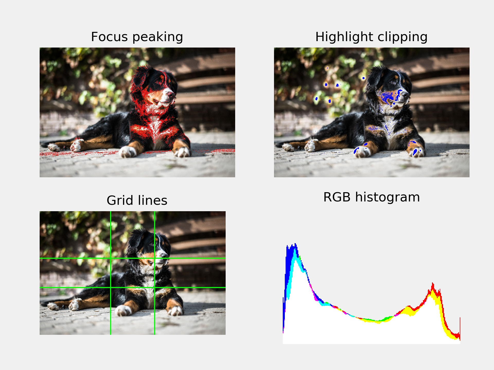

# photo-diagnostic-tools
Diagnostic tools for photo editing, such as RGB histograms, focus peaking, highlight clipping warning, and EXIF data.

### Usage

Create a class object for a jpg image by specifying its path. Execute functions and plot results with matplotlib as exemplified in the script. The function parameters for focus peaking may need to be adjusted depending on the image size. The EXIF data is returned as a dictionary.

The following figure demonstrates some of the features:

Copyright free example picture by [Alexander Dummer](https://www.pexels.com/@alexander-dummer-37646).

### Suggestions for more features

- More grids (e.g. Golden spiral, diagonals)
- Motion blur detection
- Noise level rating
- Red-eye detection
- Raw image support
